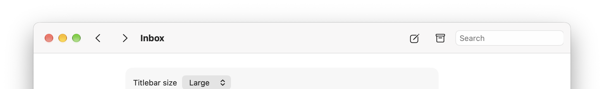
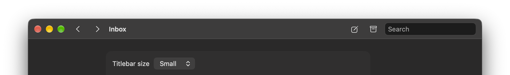

# ToolbarKit

**A SwiftUI titlebar for macOS that you control.** Put any SwiftUI view in the window's titlebar. The real close, minimise and zoom buttons stay where macOS puts them, the look is pre–Liquid Glass, and you get none of the toolbar item machinery.




```swift
import ToolbarKit

ContentView()
    .titlebar(.large) {
        Button("Back", systemImage: "chevron.left") { … }
        Text("Inbox").titlebarTitle()
        Spacer()
        Button("Compose", systemImage: "square.and.pencil") { … }
        TextField("Search", text: $query).frame(width: 180)
    }
    .buttonStyle(.titlebar)
```

## Why

On macOS the top of a window belongs to the system, and there are only two usual ways to put things there. Neither gives you a plain titlebar you control.

- **The system toolbar is item-based and now glass.** `NSToolbar` and SwiftUI's `.toolbar` take *items*, not a view. They lay them out, group them and overflow them however the current release decides. Since macOS 26 every item sits on Liquid Glass. The `UIDesignRequiresCompatibility` opt-out is ignored for apps built with the macOS 27 SDK, so the system toolbar can no longer be taken back to the classic look.
- **Custom titlebars usually break the window.** Hide the titlebar and draw your own, and the usual casualties are:
  - the traffic lights: they drift, sit off-centre or have to be repositioned by hand;
  - dragging and double-click behaviour;
  - full screen.

  Most fixes reach into AppKit's private view hierarchy, and that breaks between releases.

ToolbarKit takes a third route. The window keeps a real titlebar with an **empty** system toolbar in it. The toolbar has no items, so there is nothing to draw glass on. Its only job is to set the titlebar's height, so **macOS itself places and centres the window buttons** at either size, through resizing and full screen. Your content is ordinary SwiftUI laid over that band.

No view in the window's hierarchy is moved, restyled or looked up by class name. Everything is public API.

## What you get

- **Any content.** Buttons, a title, search fields, pickers, tabs: whatever you put in the closure.
- **Two sizes, using macOS's own titlebar heights.** `.small` is the compact titlebar and `.large` the standard one, 40 and 52 pt on macOS 27. `titlebarTitle()` sizes the title to match.
- **The real window buttons**, vertically centred. Your content starts just after them.
- **Backgrounds:**
  - `.titlebar` (default): the pre-glass titlebar material.
  - `.solid`: opaque, in the titlebar's tone.
  - `.translucent`: blurs the desktop behind the window.
  - `.material(_)`: any SwiftUI material.
  - `.color(_)` or `.clear`.
- **A separator line** under the bar, on by default.
- **Window behaviour:**
  - dragging any empty part of the bar moves the window;
  - double-clicking it zooms or minimises, following the user's choice in System Settings;
  - the title and `.titlebar` buttons dim when the window is inactive, and system controls show their own inactive look;
  - in full screen the bar stays at the top.
- **`.buttonStyle(.titlebar)`**: borderless buttons in the pre-glass style, with a soft highlight on hover and press.
- **Narrow windows.** Content that doesn't fit is clipped on the right and never pushed into the window buttons. What to drop at narrow widths is up to your layout (`ViewThatFits` and friends).

## Usage

```swift
.titlebar(
    .small,                       // .small or .large (default)
    background: .translucent,     // .titlebar (default), .solid, .translucent, .material(_), .color(_), .clear
    separator: false              // default true
) {
    // your content
}
```

**Where to apply it.** Apply `.titlebar` once, to the root view of a window. The window's content automatically starts below the bar.

**Adapting to the size.** Inside the bar, `@Environment(\.titlebarSize)` tells your views which size they are in.

**A translucent window.** To let the desktop show through the whole window, not just the bar, use SwiftUI's own modifier (macOS 15):

```swift
ContentView()
    .titlebar(.large, background: .translucent) { … }
    .containerBackground(.thinMaterial, for: .window)
```

**Native tabs.** ToolbarKit windows opt out of native window tabbing, whose tab bar would otherwise appear under the titlebar.

## Requirements

- macOS 15 or later
- Swift 6 (Xcode 16 or later)

## Installation

Swift Package Manager:

```swift
.package(url: "https://github.com/rsalesas/ToolbarKit.git", from: "0.1.0")
```

## Demo

`Examples/TitlebarDemo` is a small app with switches for size, background, translucent window, appearance and the separator. It needs [XcodeGen](https://github.com/yonaskolb/XcodeGen) to generate its project:

```bash
Examples/TitlebarDemo/build.sh
open Examples/TitlebarDemo/build/TitlebarDemo.app
```

## Status

Version 0.1, macOS only. It has been checked on macOS 27, including with real mouse input:
- clicks in the bar reach your views;
- dragging the bar moves the window, and double-clicking it zooms;
- the window buttons work, including full screen;
- live resizing shows no lag.

Not yet checked:
- macOS 15 and 26;
- the full-screen reveal (moving the pointer to the top of the screen).

iOS and tvOS may follow.

## Licence

MIT. See [LICENSE](LICENSE).
